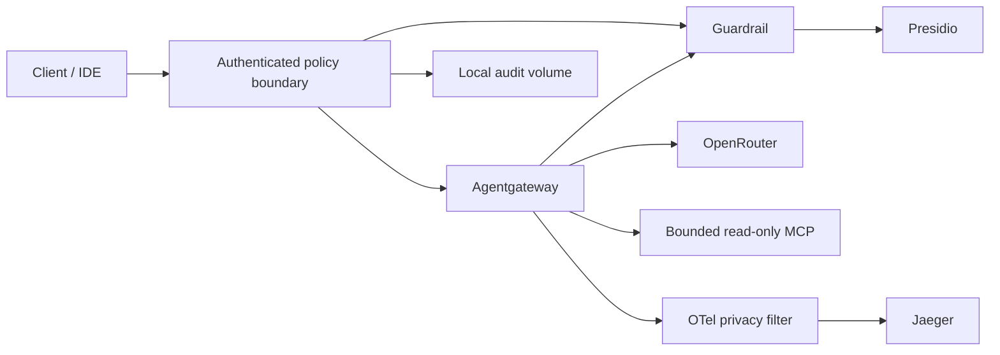

# Loom

Loom is a local AI gateway and security control plane. It mediates model calls
and a small read-only MCP filesystem through Agentgateway, with authenticated
policy checks, content inspection, bounded execution and structured audit events.
It is a production-oriented foundation, **not yet a shared production service**.

## Quickstart

Requirements: Docker Engine with Compose, Python 3, and enough memory for Presidio
(the analyzer has a 3 GiB container limit). Go 1.26.1 is needed for local Go tests;
Docker builds supply their own compiler.

```bash
make init
# Set IDE_PASSWORD and, if you need model calls, OPENROUTER_API_KEY in .env.
make up
```

`make init` creates a random local client credential in `.loom/client.token` and
a separate pipeline credential. It stores only credential hashes in the identity
registry. Credentials expire after seven days. Keep `.loom/` and `.env` private.
The local API credential is separate from the IDE password; agents receive no
sudo password. Do not put credentials in the mounted workspace.

Default localhost endpoints:

| Service | URL |
| --- | --- |
| Authenticated model API | `http://127.0.0.1:8080/v1/chat/completions` |
| Authenticated MCP | `http://127.0.0.1:3000/mcp` |
| Web IDE | `http://127.0.0.1:8443` |
| Jaeger | `http://127.0.0.1:16686` |

The guardrail, raw Agentgateway listeners and OTLP receivers are not published.
Port overrides in `.env` still work. IDE extensions must use
`http://control-plane:8080/v1` or `http://control-plane:8080/mcp` and the local
client credential as their bearer token/API key. No client authorization token
is forwarded to Agentgateway or the model provider.

To make a model request without placing a token in a process argument:

```bash
python3 scripts/model_example.py
```

Only `openai/gpt-4o-mini` is granted by the initial policy. Responses are buffered
and inspected; streaming, multimodal input, arbitrary provider parameters and
model function calls are currently rejected. MCP exposes `read_text_file` and
`list_directory`; paths must be canonical absolute paths under `/workspace`.
Symlinks, writes, command execution and unknown arguments are denied. File reads
are limited to 64 KiB; directory listings to 256 entries.

## How enforcement works



Policy matches principal, workload, tenant, scope, method, tool/model, resource,
destination, trust and sensitivity. The local registry assigns session identity;
caller identity headers cannot grant authority. All supplied content is untrusted.
A clean detector result does not turn data into trusted instructions.

The boundary checks model input and all successful upstream results. Agentgateway
retains request/response webhooks and a second CEL tool allowlist. Detected secrets
or PII are **rejected**, not silently scrubbed in a copy while the original is
forwarded. Missing, slow or malformed security dependency responses deny.
String patterns and Presidio can miss attacks; tool capability restrictions
remain independent of model obedience.

Defaults per authenticated session: 60 requests/minute, 500 admitted operations,
4 concurrent operations, a one-hour workflow lifetime, 64 KiB input, 4,096 requested
output tokens, 1 MiB response and a 30-second action timeout. These are local
process limits, not durable cross-replica quotas or monetary cost accounting.

## Policy and emergency operations

Edit `config/policy.json` atomically in the mounted directory. Policy is reread
for each request; malformed or missing policy denies. Increase `version` for each
change. `emergency_deny: true` stops new dispatches. `disabled` accepts exact
principal, workload, session, tool/model and destination identifiers. Removing a
credential from `.loom/identity/credentials.json` revokes it on its next request.
These controls do not cancel an operation already dispatched.

Restore a reviewed prior policy to roll back. Test changes before replacing the
active file. There is no unauthenticated management API. To rotate local
credentials, archive the current `.loom/` directory privately and run `make init`;
restart the control plane to bind the new directory mount. Do not reset credentials
merely to evade budgets.

## Tests and optional features

```bash
python3 -m venv .loom/test-venv
.loom/test-venv/bin/pip install httpx==0.27.2
(cd docker && go test -v -race ./... && go vet ./...)
.loom/test-venv/bin/python -m unittest discover -s tests -p 'test_*.py'
make up
./tests/smoke_test.sh
make lab
```

Smoke tests use the actual authenticated ingress, Agentgateway and stdio MCP.
They create and remove inert workspace fixtures. `make lab` is a separate
simulation: its capability/delegation score does not prove runtime authorization.
See [test evidence and limits](docs/security-implementation.md).

`make pipeline` starts the optional local ingestion/RAG prototype. Failed checks
leave documents unpromoted. Its HTTP API is local-only and lacks production
identity, tenant isolation and persistent provenance enforcement. Do not ingest
sensitive production data. Bronze stores the original submitted documents.

`make up-isolated` uses the optional gVisor override after runtime installation.
It does not remove the host workspace trust boundary. `make down` stops Loom.

## Production boundary

Do not expose this Compose deployment publicly. Before a shared deployment, add
TLS and current OAuth/OIDC authorization, durable quotas, authenticated remote
audit storage, policy-aware network egress, and separate provider credential
custody. The IDE and a compromised gateway can still use network access outside
application policy. Host compromise is outside container protection.

Audit records live in the `security-audit` volume as `security.jsonl`; traces are
operational data, not the security audit log. Arrange rotation, access controls,
retention and off-host integrity protection before sustained use.

Read the [threat model](docs/security-threat-model.md),
[prioritized roadmap](docs/security-roadmap.md), and [security policy](SECURITY.md).
