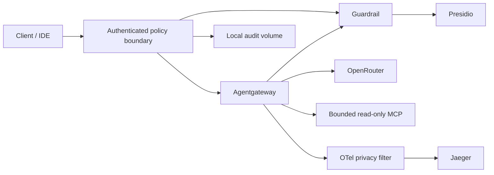

# Loom

Loom is a local AI gateway and security control plane lab. It mediates model calls
and a small read-only MCP filesystem through Agentgateway, with authenticated
policy checks, content inspection, bounded execution and structured audit events.
It is a production-oriented foundation, **not yet a shared production service**.

## Quickstart

Requirements: Docker Engine with Compose, Python 3, and enough memory for Presidio
(the analyzer has a 3 GiB container limit). Go 1.26.8 is needed for local Go tests;
Docker builds supply their own compiler.

```bash
make init
# Set IDE_PASSWORD and, if you need model calls, OPENROUTER_API_KEY in .env.
make up
```

`make init` creates a random local client credential in `.loom/client.token` and
a separate pipeline credential. It stores only credential hashes in the identity
registry. Credentials expire after seven days. Keep `.loom/` and `.env` private.
The local API credential is separate from the IDE password; agents receive no
sudo password. Do not put credentials in the mounted workspace.

Default localhost endpoints:

| Service | URL |
| --- | --- |
| Authenticated model API | `http://127.0.0.1:8080/v1/chat/completions` |
| Authenticated MCP | `http://127.0.0.1:3000/mcp` |
| Web IDE | `http://127.0.0.1:8443` |
| Jaeger | `http://127.0.0.1:16686` |

The guardrail, raw Agentgateway listeners and OTLP receivers are not published.
Port overrides in `.env` still work. IDE extensions must use
`http://control-plane:8080/v1` or `http://control-plane:8080/mcp` and the local
client credential as their bearer token/API key. No client authorization token
is forwarded to Agentgateway or the model provider.

To make a model request without placing a token in a process argument:

```bash
python3 scripts/model_example.py
```

Only `openai/gpt-4o-mini` is granted by the initial policy. Responses are buffered
and inspected; streaming, multimodal input, arbitrary provider parameters and
model function calls are currently rejected. MCP exposes `read_text_file` and
`list_directory`; paths must be canonical absolute paths under `/workspace`.
Symlinks, writes, command execution and unknown arguments are denied. File reads
are limited to 64 KiB; directory listings to 256 entries.

## How enforcement works



- **Visual Architecture**: See [Sequence Diagrams](docs/sequence-diagrams.md) for happy/unhappy execution flows.
- **Threat & Tooling Matrix**: See [Problem & Mitigation Matrix](SECURITY_MATRIX.md) for threat-to-tool mapping.
- **Enterprise Task Backlog**: See [Implementation Tasks](epics/tasks/1.md) for enterprise deployment tasks with Definitions of Done.

Policy matches principal, workload, tenant, scope, method, tool/model, resource,
destination, trust and sensitivity. The local registry assigns session identity;
caller identity headers cannot grant authority. All supplied content is untrusted.
A clean detector result does not turn data into trusted instructions.

The boundary checks model input and all successful upstream results. Agentgateway
retains request/response webhooks and a second CEL tool allowlist. Detected secrets
or PII are **rejected**, not silently scrubbed in a copy while the original is
forwarded. Missing, slow or malformed security dependency responses deny.
String patterns and Presidio can miss attacks; tool capability restrictions
remain independent of model obedience.

Model/tool circuits pause new dispatch for 30 seconds after three upstream failures.

Defaults per authenticated session: 60 requests/minute, 500 admitted operations,
4 concurrent operations, a one-hour workflow lifetime, 64 KiB input, 4,096 requested
output tokens, 1 MiB response and a 30-second action timeout. These are local
process limits, not durable cross-replica quotas or monetary cost accounting.

## Running Lab Features

Every architectural edge in Loom can be executed and verified via `make`:

| Feature Area | Execution Command | Verification / Test |
| :--- | :--- | :--- |
| **Core AI Gateway** | `make up` | `make test-smoke` (Ingress, Presidio, Agentgateway) |
| **Complete Test Suite** | `make test-all` | Runs Go unit/race + Python pytest + MCP + telemetry |
| **MCP Schema & Tool Defense** | `make mcp-init` | `make mcp-test` (Signed contracts, prompt injection) |
| **Zero-Trust SPIFFE Identity** | `make up-isolated` | `go test -v -run TestWorkload ./security` (SVIDs, mTLS) |
| **Dex OIDC Federation** | `make dex-up` | `make dex-token` (PKCE & Client Credentials tokens) |
| **Strands Multi-Agent Swarm** | `make strands-lab` | `make strands-test` (Role credentials, taint lineage) |
| **Adversarial Swarm Lab** | `make lab` | `make lab-json` (Emits machine-readable score report) |
| **Ingestion Pipeline & RAG** | `make pipeline` | `make pipeline-rag` (Medallion bronze/silver/gold + RAG) |
| **Compliance Telemetry** | `make test-telemetry`| Validates OTel normalization to BlackShield schema |
| **Environment & Tool Health**| `make doctor` | `make check` (Linter, compose config, go vet) |

## Production boundary

Do not expose this Compose deployment publicly. Before a shared deployment, add
TLS and current OAuth/OIDC authorization, durable quotas, authenticated remote
audit storage, policy-aware network egress, and separate provider credential
custody. The IDE and a compromised gateway can still use network access outside
application policy. Host compromise is outside container protection.

Audit records live in the `security-audit` volume as `security.jsonl`; traces are
operational data, not the security audit log. Arrange rotation, access controls,
retention and off-host integrity protection before sustained use. The local audit
file stops accepting events at 100 MiB; maintain it with the control plane stopped.

Read the [threat model](docs/security-threat-model.md),
[prioritized roadmap](docs/security-roadmap.md), and [security policy](SECURITY.md).

## Strands reference agents

Run `make strands-lab` for a keyless multi-agent lab using real Strands model and
MCP calls through Loom. `make strands-test` checks the locked Python integration;
`make strands` runs the optional real-model example with your configured provider
key. Agents run in separate hardened containers with role-specific credentials.
See the [Strands guide](integrations/strands/README.md) and
[security design](docs/strands-integration.md) for the trust boundaries and limits.
