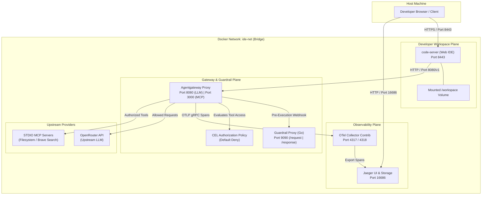
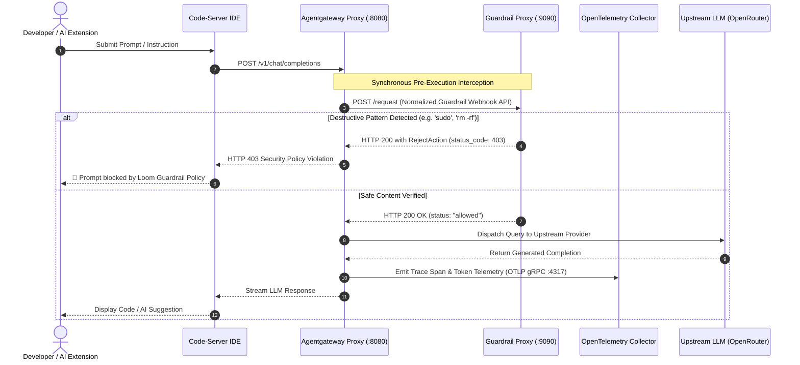

# Loom — Enterprise Cloud Development & AI Gateway Platform

[](https://github.com/cchostak/loom/actions/workflows/ci.yml)
[](https://github.com/cchostak/loom/actions/workflows/security.yml)
[](https://opensource.org/licenses/Apache-2.0)
[](https://golang.org)
[](https://docker.com)

Loom is a containerized, production-grade cloud development platform and AI security gateway. It couples a browser-accessible VS Code (`code-server`) workspace with an intelligent reverse proxy (`Agentgateway`), synchronous pre-execution guardrail filtering (`guardrail-proxy`), Common Expression Language (CEL) tool authorization, and end-to-end distributed tracing via OpenTelemetry and Jaeger.

---

## 🏛️ Architecture Overview

Loom isolates developer workloads while providing secure, observed access to Large Language Models (LLMs) and Model Context Protocol (MCP) tool integrations.

### Component & Network Topology



### Pre-Execution Prompt Flow & Guardrail Enforcement



---

## ⚡ Quickstart Guide (< 5 Minutes)

### 1. Prerequisites
Ensure your workstation meets the following minimum requirements:
- **Docker Engine** 24.0+ & **Docker Compose** v2.20+
- **Go** 1.22+ (for local test development)
- **Make** 4.0+
- **curl** and **git**

Verify your environment using our self-diagnostic command:
```bash
make doctor
```

### 2. Initialization & Configuration
```bash
# Clone the repository
git clone https://github.com/cchostak/loom.git
cd loom

# Initialize configuration template (.env)
make init
```

Edit `.env` to configure your credentials:
```bash
OPENROUTER_API_KEY=sk-or-v1-your-real-key-here
IDE_PASSWORD=your_strong_workspace_password
```

### 3. Launch Stack
```bash
make up
```

### 4. Verify Stack Health
```bash
make test-smoke
```

### 5. Run the Adversarial Agent Swarm Lab

```bash
make lab
```

This keyless lab compares four inert attack chains against an unprotected
baseline and Loom's live guardrail, capability, and delegation controls. It
does not call an LLM or execute attack commands. See
[`docs/adversarial-swarm-lab.md`](docs/adversarial-swarm-lab.md) for the threat
model and extension points.

### 6. Access Dashboards & Workspace

| Service | Host URL | Description |
| :--- | :--- | :--- |
| **Code-Server (Web IDE)** | [http://localhost:8443](http://localhost:8443) | Cloud VS Code (Login using `IDE_PASSWORD`) |
| **Jaeger UI (Observability)** | [http://localhost:16686](http://localhost:16686) | Distributed tracing, spans, and latency waterfalls |
| **Agentgateway (LLM)** | `http://localhost:8080/v1` | OpenAI-compatible proxy with guardrail hooks |
| **Agentgateway (MCP)** | `http://localhost:3000` | Model Context Protocol server endpoint |
| **Guardrail Proxy** | [http://localhost:9090/health](http://localhost:9090/health) | Guardrail health and status check |

---

## ⚙️ Configuration Reference Table

### Environment Variables (`.env`)

| Variable | Required | Default | Description |
| :--- | :---: | :--- | :--- |
| `OPENROUTER_API_KEY` | **Yes** | `""` | API key used by Agentgateway to route completions to OpenRouter |
| `IDE_PASSWORD` | **Yes** | `ide_super_secret_password_change_me` | Web UI password protecting the `code-server` instance |
| `AGENTGATEWAY_CONFIG_FILE`| No | `/etc/agentgateway/config.yaml` | Container path to Agentgateway YAML configuration |
| `PORT` | No | `9090` | Internal port for the Go `guardrail-proxy` service |

All published host ports can be overridden without editing Compose. Set
`LOOM_IDE_PORT`, `LOOM_LLM_PORT`, `LOOM_MCP_PORT`, `LOOM_GUARDRAIL_PORT`,
`LOOM_JAEGER_PORT`, `LOOM_OTEL_GRPC_PORT`, or `LOOM_OTEL_HTTP_PORT` in `.env`.
For example, set `LOOM_IDE_PORT=8444` when another local service owns 8443.

### Port Allocations

| Port | Service | Protocol | Scope | Purpose |
| :---: | :--- | :---: | :---: | :--- |
| **8443** | `vscode` | HTTP | Public | Browser Web IDE Interface |
| **8080** | `agentgateway` | HTTP | Public / Internal | OpenAI-compatible `/v1` LLM endpoint |
| **3000** | `agentgateway` | HTTP | Public / Internal | Model Context Protocol (MCP) server gateway |
| **9090** | `guardrail-proxy` | HTTP | Public / Internal | Guardrail webhooks (`/request`, `/response`) and compatibility API (`/validate`) |
| **16686**| `jaeger` | HTTP | Public | Jaeger distributed tracing web UI |
| **4317** | `otel-collector` | gRPC | Public / Internal | OpenTelemetry OTLP gRPC receiver |
| **4318** | `otel-collector` | HTTP | Public / Internal | OpenTelemetry OTLP HTTP receiver |

---

## 🛠️ Developer Tooling & Makefile Ergonomics

| Command | Description |
| :--- | :--- |
| `make help` | Display available targets with descriptions |
| `make init` | Initialize `.env` template and project directory tree |
| `make up` | Build and start all containers in detached mode |
| `make down` | Gracefully stop and remove all stack containers |
| `make restart` | Restart all services cleanly |
| `make logs` | Stream consolidated real-time logs across all services |
| `make status` | Display container state, health checks, and port mappings |
| `make trace` | Display Jaeger observability dashboard guide and links |
| `make check` | Run static linters (`go vet`, `gofmt`, `yamllint`, `shellcheck`) |
| `make fmt` | Auto-format Go code and shell scripts |
| `make test` | Execute Go unit tests with race detection and coverage reporting |
| `make test-smoke`| Execute automated end-to-end integration smoke test suite |
| `make lab` | Run the keyless adversarial agent-swarm lab |
| `make lab-json` | Emit the adversarial lab report as JSON |
| `make scan` | Run local vulnerability and secret audits |
| `make doctor` | Validate host prerequisites, ports, Docker daemon, and environment |
| `make clean` | Deep clean containers, network bridges, and test coverage artifacts |

---

## 🔍 Troubleshooting Guide

### 1. Port Conflict Error (`bind: address already in use`)
- **Symptom**: `docker compose up` fails with `Error response from daemon: driver failed programming external connectivity on endpoint ...: bind: address already in use`.
- **Diagnostic**:
  ```bash
  # Check which process is occupying the port (e.g. 8443 or 8080)
  sudo lsof -i :8443 -i :8080 -i :9090 -i :16686
  ```
- **Remediation**: Terminate competing processes or override external port bindings in `docker-compose.yml`.

---

### 2. Prompt Blocked with HTTP 403 Forbidden
- **Symptom**: LLM queries in `code-server` fail with `403 Forbidden: Forbidden content detected by guardrail policy`.
- **Diagnostic**:
  Check `guardrail-proxy` logs to inspect matched forbidden patterns:
  ```bash
  docker compose logs guardrail-proxy
  ```
- **Remediation**: Guardrail rules prohibit destructive system commands (`sudo`, `rm -rf`, `chmod 777`, `:(){ :|:& };:`, etc.). Rephrase the prompt without forbidden system commands or update `ForbiddenPatterns` in `docker/main.go` if custom rules are required.

---

### 3. Missing or Truncated OpenTelemetry Traces in Jaeger
- **Symptom**: Jaeger UI (`http://localhost:16686`) does not show recent `agentgateway` trace spans.
- **Diagnostic**:
  ```bash
  # Verify OTel Collector logs
  docker compose logs otel-collector
  # Verify connectivity to OTLP port 4317
  nc -zv localhost 4317
  ```
- **Remediation**: Ensure `otel-collector` is running and healthy. Verify `config/agentgateway-config.yaml` specifies `host: "otel-collector:4317"`.

---

### 4. Code-Server Authentication Failure
- **Symptom**: `code-server` rejects login credentials.
- **Diagnostic**:
  Verify the active password configured in `.env`:
  ```bash
  grep IDE_PASSWORD .env
  ```
- **Remediation**: Update `IDE_PASSWORD` in `.env` and restart the stack (`make restart`).

---

## 📜 Architecture Decision Records (ADRs)

Key architectural decisions are documented under [`docs/adr/`](file:///home/chris/Desktop/loom/docs/adr/):
- **[ADR 0001: Record Architecture Decisions](file:///home/chris/Desktop/loom/docs/adr/0001-record-architecture-decisions.md)**
- **[ADR 0002: Core Architecture, Gateway Protocols & Security Boundaries](file:///home/chris/Desktop/loom/docs/adr/0002-core-architecture-and-stack.md)**

---

## 🔒 Security & Vulnerability Reporting

Please review our [SECURITY.md](file:///home/chris/Desktop/loom/SECURITY.md) for vulnerability reporting procedures, SLAs, and security guarantees.

---

## 🤝 Contributing

Contributions are welcome! Please review [CONTRIBUTING.md](file:///home/chris/Desktop/loom/CONTRIBUTING.md) for code style, branch naming, and pull request guidelines.

---

## 📄 License

Loom is open-source software licensed under the [Apache License 2.0](file:///home/chris/Desktop/loom/LICENSE).
