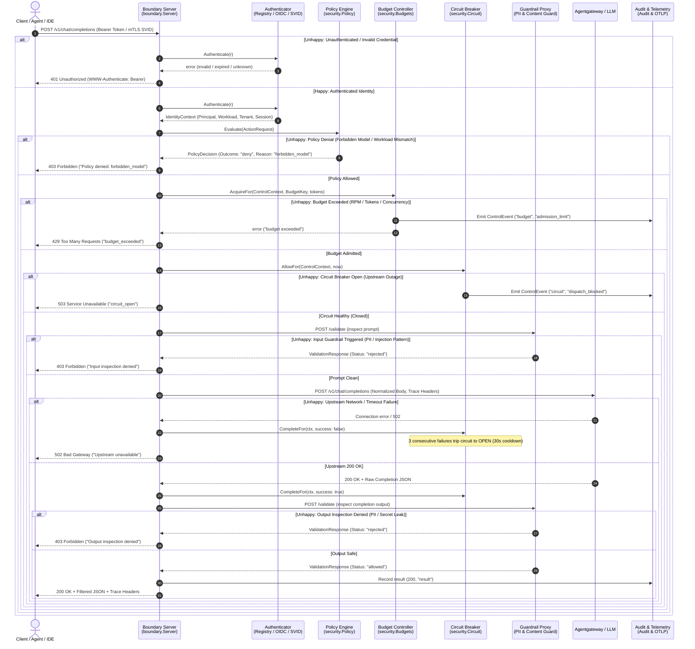
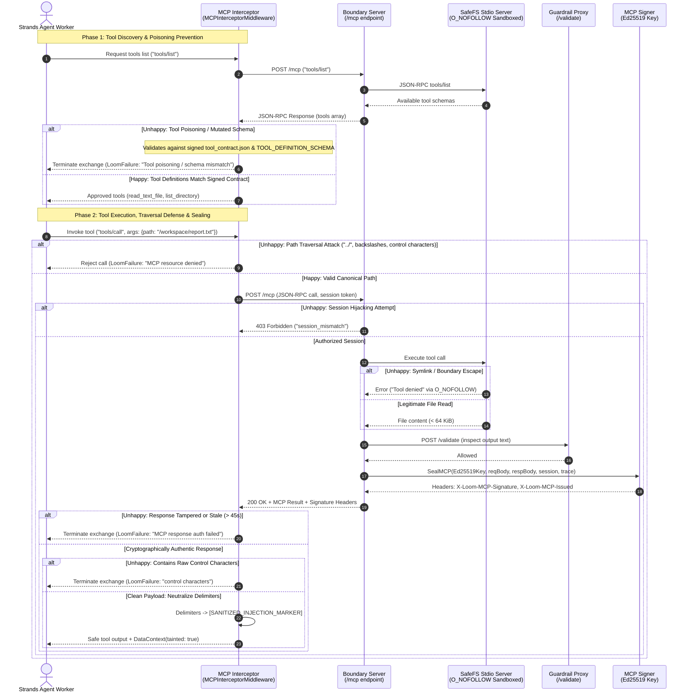
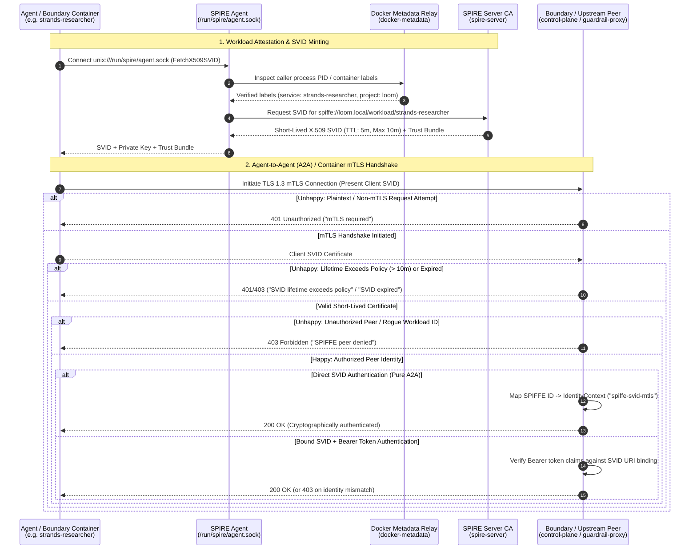
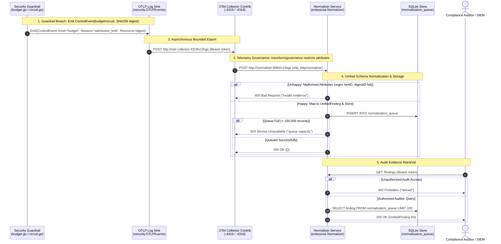
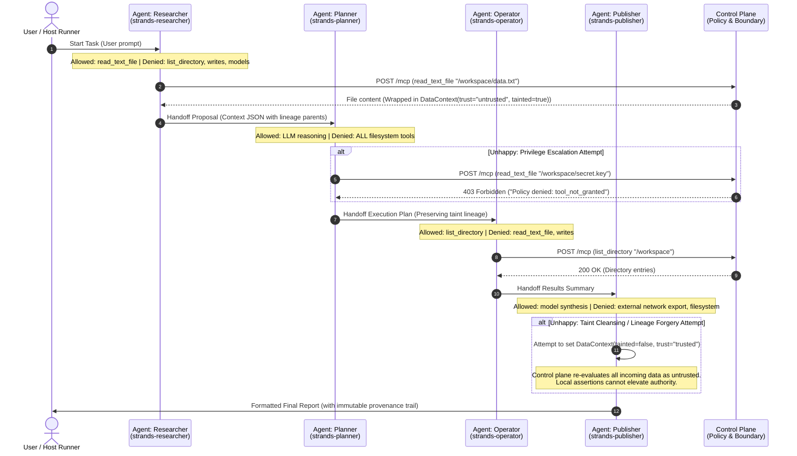

# Loom Security Architecture — Sequence Diagrams

This document illustrates the operational sequences across Loom's security boundaries, detailing both **happy flows** (authorized, inspected execution) and **unhappy flows** (denials, tampering, quota limits, circuit breaks, and attack mitigations).

- [1. AI Model Inference Mediation](#1-ai-model-inference-mediation)
- [2. Model Context Protocol (MCP) Tool Execution & Cryptographic Sealing](#2-model-context-protocol-mcp-tool-execution--cryptographic-sealing)
- [3. Zero-Trust Workload Identity (SPIFFE/SPIRE & mTLS A2A)](#3-zero-trust-workload-identity-spiffespire--mtls-a2a)
- [4. Telemetry Normalization & Unified Compliance Evidence Queue](#4-telemetry-normalization--unified-compliance-evidence-queue)
- [5. Multi-Agent Swarm Orchestration, Least Privilege & Lineage Handoff](#5-multi-agent-swarm-orchestration-least-privilege--lineage-handoff)
- [Summary Defense Matrix](#summary-defense-matrix)

---

## 1. AI Model Inference Mediation

Mediation flow for user and agent model completion requests through authentication, versioned policy, session budgets, circuit breaker, content guardrails, and audit logging.

---

## 2. Model Context Protocol (MCP) Tool Execution & Cryptographic Sealing

MCP tool discovery, offline signed tool contracts, schema validation, prompt injection sanitization, safe filesystem sandboxing, and response cryptographic sealing.

---

## 3. Zero-Trust Workload Identity (SPIFFE/SPIRE & mTLS A2A)

Multi-agent swarms and backend containers establish cryptographic identity using short-lived SPIFFE Verifiable Identity Documents (SVIDs) and mutual TLS.

---

## 4. Telemetry Normalization & Unified Compliance Evidence Queue

Guardrail trigger events (budget limits, circuit breaker trips) converted to OpenTelemetry log records, transformed by OTel Collector, normalized into the BlackShield Unified Finding schema, and stored in the SQLite compliance queue.

---

## 5. Multi-Agent Swarm Orchestration, Least Privilege & Lineage Handoff

Swarm roles (Researcher, Planner, Operator, Publisher) collaborate under least privilege, immutable data taint tracking, and turn boundaries.

---

## Summary Defense Matrix

| Boundary / Layer | Happy Path Guarantee | Unhappy Path Defense | Enforcing Component |
| :--- | :--- | :--- | :--- |
| **Authentication** | Valid token/SVID resolves to verified `IdentityContext` | Missing/expired/tampered credentials fail closed with 401 | `Registry`, `OIDC`, `WorkloadAuth` |
| **Policy** | Explicit versioned allow rules match principal & tool | Default-deny on all ungranted models, tools, or resources (403) | `security.Policy` |
| **Execution Budgets** | Admitted operations tracked against session limits | 429 Too Many Requests on RPM, token, call, or concurrency breach | `security.Budgets` |
| **Circuit Breakers** | Fast passthrough during healthy upstream operation | 503 Service Unavailable when 3 upstream failures occur (30s cooldown) | `security.Circuit` |
| **Content Inspection** | Clean prompts and completions pass with correlation headers | 403 on PII detection or disallowed destructive/injection commands | `guardrail-proxy`, `pii.Scrubber` |
| **MCP Validation** | Offline signed tool contracts execute with validated schema | Rejection on schema mutation, tool poisoning, or prompt injection | `MCPInterceptorMiddleware` |
| **Filesystem (SafeFS)** | Regular file reads constrained under `/workspace` | `O_NOFOLLOW` descriptor-relative resolution blocks traversal & symlinks | `docker/safefs/` |
| **Zero-Trust Identity** | Short-lived SVIDs (< 10m) enable cryptographic mTLS A2A | Non-mTLS, expired certs, or unlisted SPIFFE IDs rejected | SPIFFE/SPIRE, `SVIDMiddleware` |
| **Audit & Governance** | OTel events normalized into unified compliance finding schema | Tampered telemetry rejected (400), audit queue bounded at 100k (503) | `OTelCollector`, `Normalizer` |
