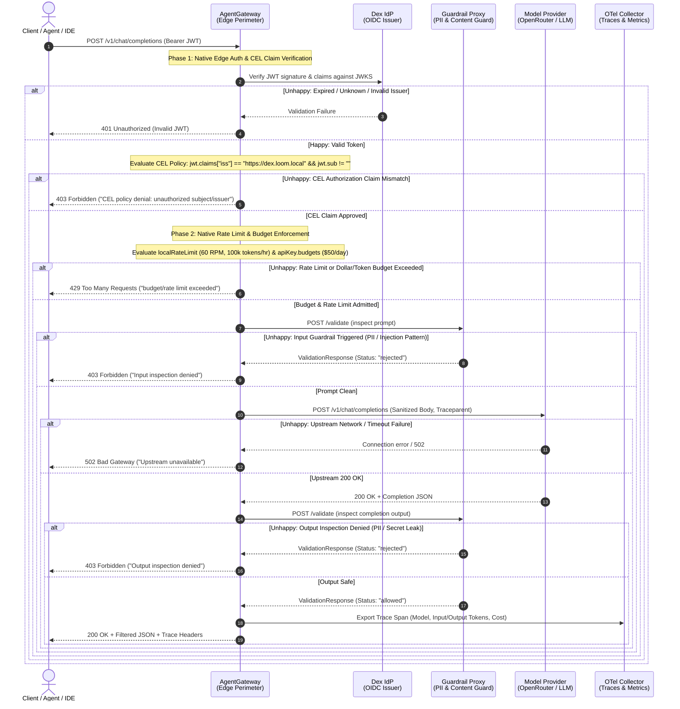
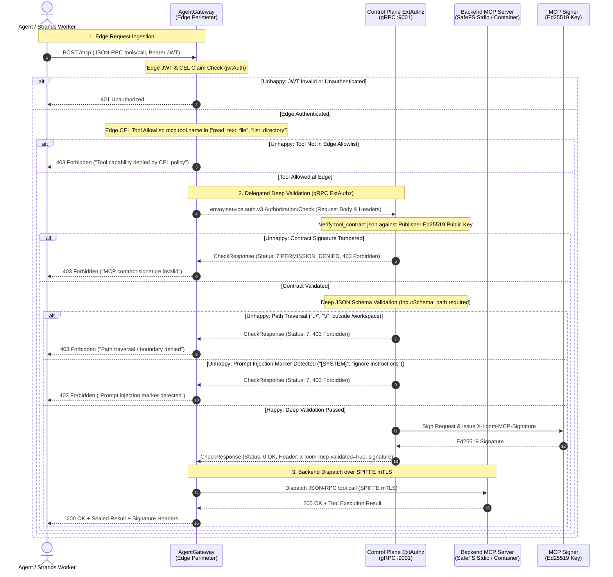
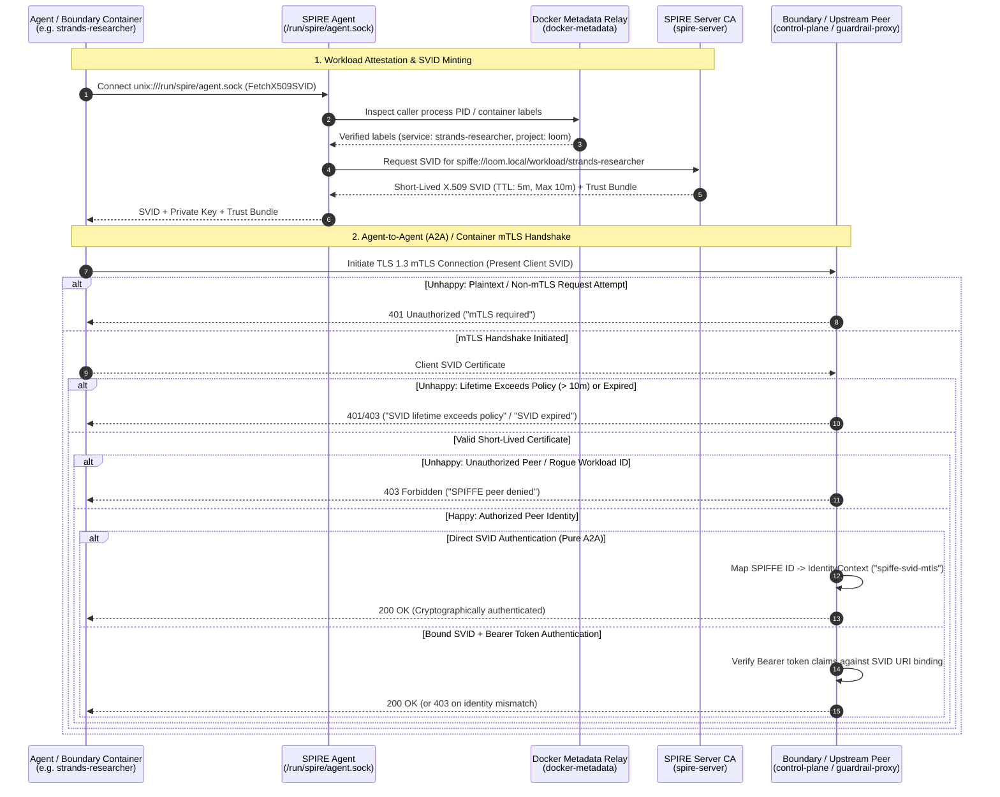
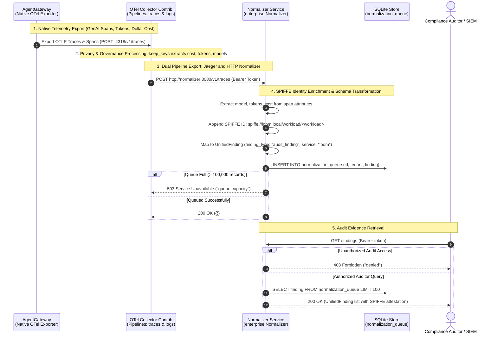
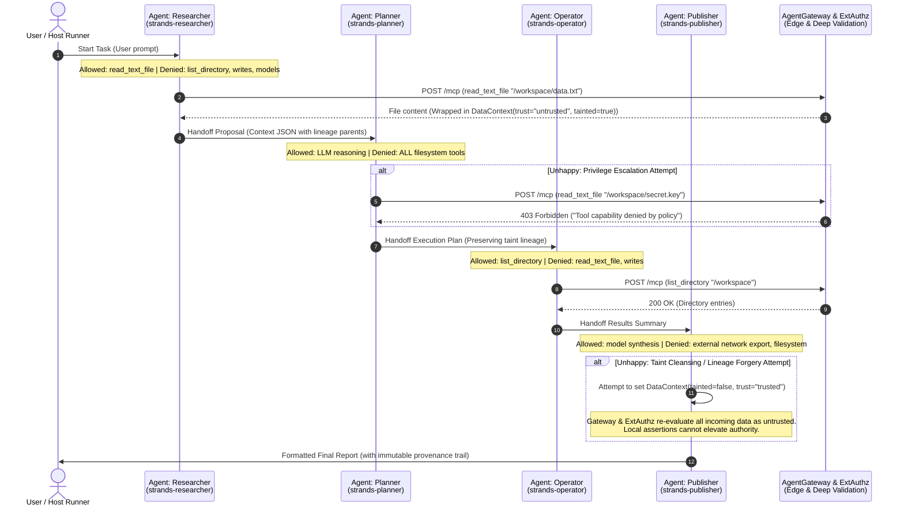

# Loom Security Architecture — Sequence Diagrams

This document illustrates the operational sequences across Loom's security boundaries, detailing both **happy flows** (authorized, inspected execution) and **unhappy flows** (denials, tampering, quota limits, circuit breaks, and attack mitigations).

- [1. AI Model Inference Mediation (AgentGateway Edge)](#1-ai-model-inference-mediation-agentgateway-edge)
- [2. Model Context Protocol (MCP) Tool Execution & ExtAuthz Deep Validation](#2-model-context-protocol-mcp-tool-execution--extauthz-deep-validation)
- [3. Zero-Trust Workload Identity (SPIFFE/SPIRE & mTLS A2A)](#3-zero-trust-workload-identity-spiffespire--mtls-a2a)
- [4. Telemetry Normalization & Unified Compliance Evidence Queue](#4-telemetry-normalization--unified-compliance-evidence-queue)
- [5. Multi-Agent Swarm Orchestration, Least Privilege & Lineage Handoff](#5-multi-agent-swarm-orchestration-least-privilege--lineage-handoff)
- [Summary Defense Matrix](#summary-defense-matrix)

---

## 1. AI Model Inference Mediation (AgentGateway Edge)

Mediation flow for user and agent model completion requests through edge authentication, CEL claim policies, native token/dollar budgets, local rate limits, content guardrails, and audit logging.

```mermaid
sequenceDiagram
    autonumber
    actor Client as Client / Agent / IDE
    participant Gateway as AgentGateway<br/>(Edge Perimeter)
    participant Dex as Dex IdP<br/>(OIDC Issuer)
    participant Guard as Guardrail Proxy<br/>(PII & Content Guard)
    participant Upstream as Model Provider<br/>(OpenRouter / LLM)
    participant OTel as OTel Collector<br/>(Traces & Metrics)

    Client->>Gateway: POST /v1/chat/completions (Bearer JWT)
    Note over Gateway: Phase 1: Native Edge Auth & CEL Claim Verification
    Gateway->>Dex: Verify JWT signature & claims against JWKS
    alt Unhappy: Expired / Unknown / Invalid Issuer
        Dex-->>Gateway: Validation Failure
        Gateway-->>Client: 401 Unauthorized (Invalid JWT)
    else Happy: Valid Token
        Note over Gateway: Evaluate CEL Policy: jwt.claims["iss"] == "https://dex.loom.local" && jwt.sub != ""
        alt Unhappy: CEL Authorization Claim Mismatch
            Gateway-->>Client: 403 Forbidden ("CEL policy denial: unauthorized subject/issuer")
        else CEL Claim Approved
            Note over Gateway: Phase 2: Native Rate Limit & Budget Enforcement
            Note over Gateway: Evaluate localRateLimit (60 RPM, 100k tokens/hr) & apiKey.budgets ($50/day)
            alt Unhappy: Rate Limit or Dollar/Token Budget Exceeded
                Gateway-->>Client: 429 Too Many Requests ("budget/rate limit exceeded")
            else Budget & Rate Limit Admitted
                Gateway->>Guard: POST /validate (inspect prompt)
                alt Unhappy: Input Guardrail Triggered (PII / Injection Pattern)
                    Guard-->>Gateway: ValidationResponse (Status: "rejected")
                    Gateway-->>Client: 403 Forbidden ("Input inspection denied")
                else Prompt Clean
                    Gateway->>Upstream: POST /v1/chat/completions (Sanitized Body, Traceparent)
                    alt Unhappy: Upstream Network / Timeout Failure
                        Upstream-->>Gateway: Connection error / 502
                        Gateway-->>Client: 502 Bad Gateway ("Upstream unavailable")
                    else Upstream 200 OK
                        Upstream-->>Gateway: 200 OK + Completion JSON
                        Gateway->>Guard: POST /validate (inspect completion output)
                        alt Unhappy: Output Inspection Denied (PII / Secret Leak)
                            Guard-->>Gateway: ValidationResponse (Status: "rejected")
                            Gateway-->>Client: 403 Forbidden ("Output inspection denied")
                        else Output Safe
                            Guard-->>Gateway: ValidationResponse (Status: "allowed")
                            Gateway->>OTel: Export Trace Span (Model, Input/Output Tokens, Cost)
                            Gateway-->>Client: 200 OK + Filtered JSON + Trace Headers
                        end
                    end
                end
            end
        end
    end
```

---

## 2. Model Context Protocol (MCP) Tool Execution & ExtAuthz Deep Validation

Operational flow: `Client -> AgentGateway (OIDC/Budget/RateLimit via CEL) -> gRPC ExtAuthz (Deep Schema/Crypto check) -> Backend Agent/MCP Server (SPIFFE mTLS)`.

```mermaid
sequenceDiagram
    autonumber
    actor Client as Agent / Strands Worker
    participant Gateway as AgentGateway<br/>(Edge Perimeter)
    participant ExtAuthz as Control Plane ExtAuthz<br/>(gRPC :9001)
    participant SafeFS as Backend MCP Server<br/>(SafeFS Stdio / Container)
    participant Signer as MCP Signer<br/>(Ed25519 Key)

    Note over Client,Gateway: 1. Edge Request Ingestion
    Client->>Gateway: POST /mcp (JSON-RPC tools/call, Bearer JWT)
    Note over Gateway: Edge JWT & CEL Claim Check (jwtAuth)
    alt Unhappy: JWT Invalid or Unauthenticated
        Gateway-->>Client: 401 Unauthorized
    else Edge Authenticated
        Note over Gateway: Edge CEL Tool Allowlist: mcp.tool.name in ["read_text_file", "list_directory"]
        alt Unhappy: Tool Not in Edge Allowlist
            Gateway-->>Client: 403 Forbidden ("Tool capability denied by CEL policy")
        else Tool Allowed at Edge
            Note over Gateway,ExtAuthz: 2. Delegated Deep Validation (gRPC ExtAuthz)
            Gateway->>ExtAuthz: envoy.service.auth.v3.Authorization/Check (Request Body & Headers)
            Note over ExtAuthz: Verify tool_contract.json against Publisher Ed25519 Public Key
            alt Unhappy: Contract Signature Tampered
                ExtAuthz-->>Gateway: CheckResponse (Status: 7 PERMISSION_DENIED, 403 Forbidden)
                Gateway-->>Client: 403 Forbidden ("MCP contract signature invalid")
            else Contract Validated
                Note over ExtAuthz: Deep JSON Schema Validation (InputSchema: path required)
                alt Unhappy: Path Traversal ("../", "\\", outside /workspace)
                    ExtAuthz-->>Gateway: CheckResponse (Status: 7, 403 Forbidden)
                    Gateway-->>Client: 403 Forbidden ("Path traversal / boundary denied")
                else Unhappy: Prompt Injection Marker Detected ("[SYSTEM]", "ignore instructions")
                    ExtAuthz-->>Gateway: CheckResponse (Status: 7, 403 Forbidden)
                    Gateway-->>Client: 403 Forbidden ("Prompt injection marker detected")
                else Happy: Deep Validation Passed
                    ExtAuthz->>Signer: Sign Request & Issue X-Loom-MCP-Signature
                    Signer-->>ExtAuthz: Ed25519 Signature
                    ExtAuthz-->>Gateway: CheckResponse (Status: 0 OK, Header: x-loom-mcp-validated=true, signature)
                    Note over Gateway,SafeFS: 3. Backend Dispatch over SPIFFE mTLS
                    Gateway->>SafeFS: Dispatch JSON-RPC tool call (SPIFFE mTLS)
                    SafeFS-->>Gateway: 200 OK + Tool Execution Result
                    Gateway-->>Client: 200 OK + Sealed Result + Signature Headers
                end
            end
        end
    end
```

---

## 3. Zero-Trust Workload Identity (SPIFFE/SPIRE & mTLS A2A)

Multi-agent swarms and backend containers establish cryptographic identity using short-lived SPIFFE Verifiable Identity Documents (SVIDs) and mutual TLS.

```mermaid
sequenceDiagram
    autonumber
    participant Workload as Agent / Boundary Container<br/>(e.g. strands-researcher)
    participant SPIREAgent as SPIRE Agent<br/>(/run/spire/agent.sock)
    participant DockerRelay as Docker Metadata Relay<br/>(docker-metadata)
    participant SPIREServer as SPIRE Server CA<br/>(spire-server)
    participant Peer as Boundary / Upstream Peer<br/>(control-plane / guardrail-proxy)

    Note over Workload,SPIREServer: 1. Workload Attestation & SVID Minting
    Workload->>SPIREAgent: Connect unix:///run/spire/agent.sock (FetchX509SVID)
    SPIREAgent->>DockerRelay: Inspect caller process PID / container labels
    DockerRelay-->>SPIREAgent: Verified labels (service: strands-researcher, project: loom)
    SPIREAgent->>SPIREServer: Request SVID for spiffe://loom.local/workload/strands-researcher
    SPIREServer-->>SPIREAgent: Short-Lived X.509 SVID (TTL: 5m, Max 10m) + Trust Bundle
    SPIREAgent-->>Workload: SVID + Private Key + Trust Bundle

    Note over Workload,Peer: 2. Agent-to-Agent (A2A) / Container mTLS Handshake
    Workload->>Peer: Initiate TLS 1.3 mTLS Connection (Present Client SVID)
    alt Unhappy: Plaintext / Non-mTLS Request Attempt
        Peer-->>Workload: 401 Unauthorized ("mTLS required")
    else mTLS Handshake Initiated
        Workload-->>Peer: Client SVID Certificate
        alt Unhappy: Lifetime Exceeds Policy (> 10m) or Expired
            Peer-->>Workload: 401/403 ("SVID lifetime exceeds policy" / "SVID expired")
        else Valid Short-Lived Certificate
            alt Unhappy: Unauthorized Peer / Rogue Workload ID
                Peer-->>Workload: 403 Forbidden ("SPIFFE peer denied")
            else Happy: Authorized Peer Identity
                alt Direct SVID Authentication (Pure A2A)
                    Peer->>Peer: Map SPIFFE ID -> IdentityContext ("spiffe-svid-mtls")
                    Peer-->>Workload: 200 OK (Cryptographically authenticated)
                else Bound SVID + Bearer Token Authentication
                    Peer->>Peer: Verify Bearer token claims against SVID URI binding
                    Peer-->>Workload: 200 OK (or 403 on identity mismatch)
                end
            end
        end
    end
```

---

## 4. Telemetry Normalization & Unified Compliance Evidence Queue

AgentGateway native trace, metric, and cost outputs ingested by OTel Collector, routed to the Normalizer service, enriched with SPIFFE workload identity context, and transformed into the unified governance finding schema.

```mermaid
sequenceDiagram
    autonumber
    participant Gateway as AgentGateway<br/>(Native OTel Exporter)
    participant OTelCol as OTel Collector Contrib<br/>(Pipelines: traces & logs)
    participant Normalizer as Normalizer Service<br/>(enterprise.Normalizer)
    participant Queue as SQLite Store<br/>(normalization_queue)
    actor Auditor as Compliance Auditor / SIEM

    Note over Gateway,OTelCol: 1. Native Telemetry Export (GenAI Spans, Tokens, Dollar Cost)
    Gateway->>OTelCol: Export OTLP Traces & Spans (POST :4318/v1/traces)
    Note over OTelCol: 2. Privacy & Governance Processing: keep_keys extracts cost, tokens, models
    Note over OTelCol,Normalizer: 3. Dual Pipeline Export: Jaeger and HTTP Normalizer
    OTelCol->>Normalizer: POST http://normalizer:8080/v1/traces (Bearer Token)
    Note over Normalizer,Queue: 4. SPIFFE Identity Enrichment & Schema Transformation
    Normalizer->>Normalizer: Extract model, tokens, cost from span attributes
    Normalizer->>Normalizer: Append SPIFFE ID: spiffe://loom.local/workload/<workload>
    Normalizer->>Normalizer: Map to UnifiedFinding (finding_type: "audit_finding", service: "loom")
    Normalizer->>Queue: INSERT INTO normalization_queue (id, tenant, finding)
    alt Queue Full (> 100,000 records)
        Normalizer-->>OTelCol: 503 Service Unavailable ("queue capacity")
    else Queued Successfully
        Normalizer-->>OTelCol: 200 OK ({})
    end
    Note over Auditor,Normalizer: 5. Audit Evidence Retrieval
    Auditor->>Normalizer: GET /findings (Bearer token)
    alt Unauthorized Audit Access
        Normalizer-->>Auditor: 403 Forbidden ("denied")
    else Authorized Auditor Query
        Normalizer->>Queue: SELECT finding FROM normalization_queue LIMIT 100
        Normalizer-->>Auditor: 200 OK (UnifiedFinding list with SPIFFE attestation)
    end
```

---

## 5. Multi-Agent Swarm Orchestration, Least Privilege & Lineage Handoff

Swarm roles (Researcher, Planner, Operator, Publisher) collaborate under least privilege, immutable data taint tracking, and turn boundaries.

```mermaid
sequenceDiagram
    autonumber
    actor User as User / Host Runner
    participant Researcher as Agent: Researcher<br/>(strands-researcher)
    participant Planner as Agent: Planner<br/>(strands-planner)
    participant Operator as Agent: Operator<br/>(strands-operator)
    participant Publisher as Agent: Publisher<br/>(strands-publisher)
    participant Gateway as AgentGateway & ExtAuthz<br/>(Edge & Deep Validation)

    User->>Researcher: Start Task (User prompt)
    Note over Researcher: Allowed: read_text_file | Denied: list_directory, writes, models
    Researcher->>Gateway: POST /mcp (read_text_file "/workspace/data.txt")
    Gateway-->>Researcher: File content (Wrapped in DataContext(trust="untrusted", tainted=true))
    Researcher->>Planner: Handoff Proposal (Context JSON with lineage parents)
    Note over Planner: Allowed: LLM reasoning | Denied: ALL filesystem tools
    alt Unhappy: Privilege Escalation Attempt
        Planner->>Gateway: POST /mcp (read_text_file "/workspace/secret.key")
        Gateway-->>Planner: 403 Forbidden ("Tool capability denied by policy")
    end
    Planner->>Operator: Handoff Execution Plan (Preserving taint lineage)
    Note over Operator: Allowed: list_directory | Denied: read_text_file, writes
    Operator->>Gateway: POST /mcp (list_directory "/workspace")
    Gateway-->>Operator: 200 OK (Directory entries)
    Operator->>Publisher: Handoff Results Summary
    Note over Publisher: Allowed: model synthesis | Denied: external network export, filesystem
    alt Unhappy: Taint Cleansing / Lineage Forgery Attempt
        Publisher->>Publisher: Attempt to set DataContext(tainted=false, trust="trusted")
        Note over Publisher: Gateway & ExtAuthz re-evaluate all incoming data as untrusted.<br/>Local assertions cannot elevate authority.
    end
    Publisher->>User: Formatted Final Report (with immutable provenance trail)
```

---

## Summary Defense Matrix

| Boundary / Layer | Happy Path Guarantee | Unhappy Path Defense | Enforcing Component |
| :--- | :--- | :--- | :--- |
| **Perimeter Identity** | Dex OIDC JWT validated against JWKS | Missing/expired/tampered tokens or bad claims rejected with 401/403 | `AgentGateway` (`jwtAuth`, CEL `authorization`) |
| **Execution Rate & Budgets** | Admitted operations tracked against token & dollar limits | 429 Too Many Requests on RPM breach (60 RPM) or dollar budget breach ($50/day) | `AgentGateway` (`localRateLimit`, `apiKey.budgets`, `modelCatalog`) |
| **Tool Allowlisting** | Tool calls matched against allowlist | Unregistered capabilities blocked immediately at edge (403) | `AgentGateway` (CEL `mcpAuthorization`) |
| **Deep Schema & Contract** | Offline signed `tool_contract.json` verified with Ed25519 | Rejection on schema mutation, unregistered tool, or missing arguments (403) | `ExtAuthzServer` (`control-plane:9001`) |
| **Path Traversal & Injection** | Regular file reads constrained strictly to `/workspace` | Blocks `..`, `\`, control chars, and prompt injection markers (403) | `ExtAuthzServer` (`control-plane:9001`) |
| **Content Inspection** | Clean prompts and completions pass with correlation headers | 403 on PII detection or disallowed destructive/injection patterns | `guardrail-proxy`, `pii.Scrubber` |
| **Zero-Trust Identity** | Short-lived SVIDs (< 10m) enable cryptographic mTLS A2A | Non-mTLS, expired certs, or unlisted SPIFFE IDs rejected | SPIFFE/SPIRE, `SVIDMiddleware` |
| **Audit & Normalization** | OTel traces normalized with SPIFFE workload identity | Normalizer enriches spans with `spiffe_id` and outputs `UnifiedFinding` | `OTelCollector`, `normalizer.go` |
